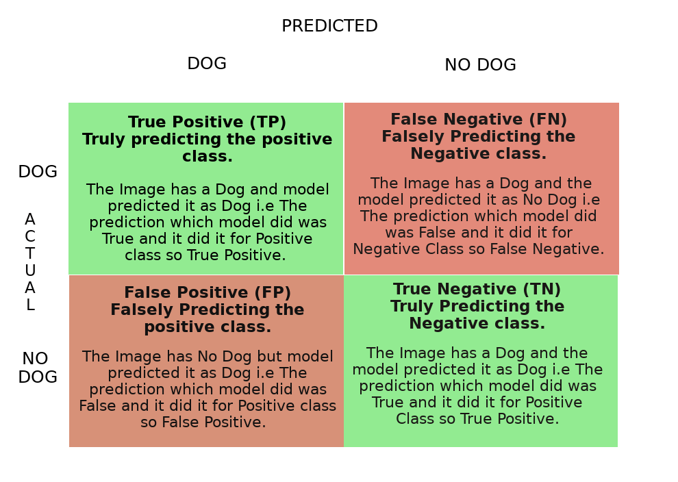

# Metrics

## Example

Let's take an example of Binary classification where the task is to predict whether we have Dog or not.
So in an Image if model predicts Dog that's a positive class if it predicts no Dog that's a negative class.

## Confusion Matrix

Let's consider this example table where N denotes the total number of images our model will predict upon. 

N = 150
Total Number of Dog Images		=	100
Total Number of No Dog Images	=	50

In total 100 Dog Images
	1. Model Predicted 60 Correct which is your True Positive.
	2. Model Predicted 40 incorrect which is False Negative.(Since It has to predict Dog and It Predicted No Dog which is a False prediction to a Negative class.)

Similarly in 50 No Dog Images
 	1. Model Predicted 30 Correct which is True Negative.
 	2. Model Predicted 20 Incorrect which is False Positive. (Since It has to predict No Dog and It predicted Dog which is a False prediction to a Positive class.)

TP->60		FN->40		 TN->30			FP->20

## Accuracy 

Accuracy is a basic metric which just tells models overall performance. How many predictions made by model is correct.
$$
Accuracy = \frac{True Positive + True Negative}{N}  
$$

$$
Accuracy = \frac{60+30}{150} = 0.6 = 60\%
$$

Accuracy gave us a idea about how 60 % prediction was correct. Accuracy can only be a good metric. if all the classes are balanced i.e No of positive sample is approximately equal to No of negative samples. Per class Accuracy can also be calculated to know for which classes model is behaving well.

## Misclassification Rate

Misclassification Rate tells overall how poor model performance is. It just opposite of Accuracy.
$$
misclassification\ rate = 1 - Accuracy
$$

$$
misclassifcation\ rate = \frac{False Postive + False Negative}{N}
$$

$$
misclassification\ rate = \frac{20+40}{150} = 0.4 = 40\%
$$

## Precision / positive predictive value

Precision is another metric which tells while predicting how accurately can I predict positive classes . 

$$
Positive\ class\ prediction  = True\ positive + False\ Positive 
$$

$$
precision = \frac{True\ Positive}{positive\ class\ prediction}
$$

$$
precision = \frac {60}{60 + 20} = 0.75 = 75\%
$$

We are only worried about the prediction of one class which is Dog and the positive prediction class will have (Positive class, Negative class) from Actuals. That's why it is positive predictive value.

Let's consider two example where 

 1. Spam detection -> Classify whether an email is Spam or Not Spam. 

    ​	Here the goal is to accurately classify spam emails. It's okay to classify a Spam mail as Not Spam mail as it will come in our inbox it does no harm to use. But if we classify as Not Spam Mail as Spam mail then there is a problem because we generally do not open our Spam Box. 

    ​	If you think about it the first case is False Negative and Second case is False Positive and we are okay with False Negative's but we are not okay with False Positives and our goal is to reduce False Positive.

    ​	So in Spam detection task precision is a good metric. since it is inversely proportionate to False Positives.  

 2. Cancer detection -> Classify whether a person has a cancer or not.

    ​	Here the goal is to accurately classify whether a person has a cancer or Not. It's okay to classify a person Not having cancer as cancer. But it's not okay to predict a person having cancer as Not cancer.

    ​	If you think the first case is False Positive and Second case is False Negative and we are okay with False Positive but not okay with False Negative.

    ​	Hence in this particular task Precision plays no role.

Hence to reduce False Positives Precision is used. Precision can easily be effected by class Imbalance.

## Negative Predictive Value

Negative Predictive Value is another metric which tells while predicting how accurately can I predict Negative classes . 

$$
Negative\ class\ prediction  = True\ Negative + False\ Negative
$$

$$
Negative\ Prediction\ Value = \frac{True\ Negative}{Negative\ class\ prediction}
$$

$$
negative\ prediction\ value = \frac {60}{60 + 20} = 0.75 = 75\%
$$

We are only worried about the prediction of one class which is Dog and the positive prediction class will have (Positive class, Negative class) from Actuals. That's why it is positive predictive value.

Let Suppose we don’t want to have any additional process for screening patients checked as healthy  (not cancer) then we may want to make sure that our negative predictive value is high.

## Recall / True Positive Rate / Sensitivity

Recall is another metric which tells us while predicting how accurately can it predict positive classes given a set of Actual Positives. 
$$
Actual\ positive\ class = True\ Positive + False\ Negative
$$

$$
recall = \frac{True\ Positive}{Actual\ positive\ class}
$$

$$
recall = \frac{60}{100} = 0.6 = 60\%
$$

Here our concern is about Given a set of Positive Samples which is like giving all the Dog images and then making prediction on it. The prediction will have (positive class , Negative class ) from Actual positives.  That's why recall is also True Positive Rate .  

The reason why it's called recall is given all the positive sample knowledge how well the model can recall that knowledge to predicted accurately by decreasing the error rate for the Actual positive class.

Going back to the Cancer Example it is very clear know that for Cancer Detection we will use Recall as our metric. Recall is good metric to be used for class Imbalance problem.

## Selectivity / True Negative Rate / Specificity

Similar to True positive rate, True Negative rate tells us while predicting how accurately can it predict Negative classes given a set of Actual Negatives. 
$$
Actual\ negative\ class = True\ Negative + False\ Positive
$$

$$
True\ Negative\ Rate = \frac{True\ Negative}{Actual\ negative\ class}
$$

$$
True\ Negative\ Rate = \frac{60}{100} = 0.6 = 60\%
$$

Here our concern is about Given a set of Negative Samples which is like giving all the No Dog images and then making prediction on it. The prediction will have (positive class , Negative class ) from Actual Negatives.

For the same cancer example True Negative rate will show how many non cancer people are identified as not having cancer.

## Sensitivity vs Specificity

n many tests, including diagnostic [medical tests](https://en.wikipedia.org/wiki/Medical_test), sensitivity is the extent to which actual positives are not overlooked  (so false negatives are few), and specificity is the extent to which  actual negatives are classified as such (so false positives are few).  Thus, a highly sensitive test rarely overlooks an actual positive (for  example, showing "nothing bad" despite something bad existing); a highly specific test rarely registers a positive classification for anything  that is not the target of testing (for example, finding one bacterial  species and mistaking it for another closely related one that is the  true target); and a test that is highly sensitive *and* highly specific does both, so it "rarely overlooks a thing that it is looking for" *and* it "rarely mistakes anything else for that thing." Because most medical tests do not have sensitivity and specificity values above 99%,  "rarely" does *not* equate to [certainty](https://en.wikipedia.org/wiki/Certainty). But for practical reasons, tests with sensitivity and specificity  values above 90% have high credibility, albeit usually no certainty, in [differential diagnosis](https://en.wikipedia.org/wiki/Differential_diagnosis).

Sensitivity, therefore, quantifies the avoidance of [false negatives](https://en.wikipedia.org/wiki/False_positives_and_false_negatives) and specificity does the same for [false positives](https://en.wikipedia.org/wiki/False_positives_and_false_negatives).

## False Positive Rate / Type I error

When the model predicts something Falsely to the positive class which then it is contributing to the False Positive rate.
we can think of it as False alert. For example if in a production house based on certain machine parameters the model has to predict whether the situation insider the production house is dangerous or not and it has to raise alarm if its dangerous. Now if everything is fine and still the model predicts as dangerous situation then that's a False alarm which you can say a False Positive Rate.

False Positive Rate is just opposite of True Negative Rate
$$
Actual\ negative\ class = True\ Negative + False\ Positive
$$

$$
False\ positive\ Rate = \frac{False\ Positive}{Actual\ negative\ class}
$$

$$
False\ Positive\ Rate = 1 - True\ Negative\ Rate
$$

The lower the False Positive Rate the better the model.

## False Negative Rate / Type - II error

When the model doesn't predict something which it should then it is contributing to the False Negative Rate.
We can think it as Miss Rate. For example in Online fraud transaction if the model classifies a Fraud Transaction as a Non Fraud Transaction then the model basically missed to catch that Fraud transaction.

False Negative Rate is just of True Positive Rate
$$
Actual\ positive\ class = True\ Positive + False\ Negative
$$

$$
False\ Negative\ Rate = \frac{False\ Negative}{Actual\ positive\ class}
$$

$$
False\ Negative\ Rate = 1 - True\ Positive\ Rate
$$

## False Discovery Rate

False Discovery Rate is just opposite of Precision It measures how many predictions out of all positive predictions were incorrect.
$$
Positive\ class\ prediction  = True\ positive + False\ Positive 
$$

$$
False\ Discovery\ Rate = \frac{False\ Positive}{positive\ class\ prediction}
$$

$$
False\ Discovery\ Rate = 1 - Precision
$$

When raising False alert is expensive it is worth looking every Positive prediction then we should optimize for precision.

## False Omission Rate

False Omission Rate is just opposite of Negative Predictive Value
$$
False\ Omission\ Rate = 1 - Negative\ Predictive\ Value
$$

## F 1 Score (beta = 1 )

Now that two important metric which is used often is precision and recall  and rather then having too look two number F1 score combines precision and recall.

The score lies in the range [0,1] with 1 being ideal and 0 being the worst.
The two ways to combine Precision and recall is
$$
Arithmetic\ Mean\\
F1\ score = \frac{precision + recall}{2}
$$

$$
Harmonic\ Mean\\
F1\ Score = \frac{2}{\frac{1}{precision} + \frac{1}{recall}}
$$

The reason to choose Harmonic mean over Arithmetic mean is precision and recall both have same numerator but different denominators so it makes no sense to average two different things as, fractions are more sensible to average by arithmetic mean when they have the same denominator. Rather we take reciprocal so that the average makes sense.

## F 2 Score (beta = 2 )

It’s a metric that combines precision and recall, putting **2x emphasis on recall**.
$$
F2\ score = \frac{1+2}{\frac{2}{precision} + \frac{1}{recall}}
$$

## F Beta Score

F beta score is a general formula for F1 score and F2 score 

When choosing beta in your F-beta score **the more you care about recall** over precision **the higher beta** you should choose. For example, with F1 score we care equally about  recall and precision with F2 score, recall is twice as important to us. 

With 0<beta<1 we care more about precision
$$
F beta \ score = \frac{1+\beta}{\frac{\beta}{precision} + \frac{1}{recall}}
$$

## Averaging parameter

**micro**

Calculate metrics globally by counting the total number of times each class was correctly predicted and incorrectly predicted. Micro Average captures class-imbalance and will bring down the precision

For example in Iris Dataset the model prediction result is given in the table

|            | TP   | FP   |
| ---------- | ---- | ---- |
| Setosa     | 45   | 5    |
| Virgnica   | 10   | 60   |
| Versicolor | 40   | 10   |

$$
micro\ precision = \frac{45 + 10 + 40}{45+ 10 + 40 + 5+60+10 }  = 0.55
$$

**macro**

Calculate metrics for each "class" independently, and find their  unweighted mean. This does not take label imbalance into account. In problems where infrequent classes are nonetheless important, macro-averaging may be a means of highlighting their performance. On the other hand, the assumption that all classes are equally important is often untrue, such that macro-averaging will over-emphasize the typically low performance on an infrequent class. 
$$
Setosa\ precision = \frac{45}{45+5} =0.9\\
virgnica\ precision = \frac{10}{10 + 60} =0.14\\
versicolor\ precision = \frac{40}{40+10} = 0.8\\
$$

$$
Macro\ Precision = \frac{0.9+0.14+0.8}{3} = 0.613
$$

**weighted** accounts for class imbalance by computing the average of binary metrics in which each class’s score is weighted by its presence in the true data sample.

## Precision Recall Curve

https://scikit-learn.org/stable/auto_examples/model_selection/plot_precision_recall.html#sphx-glr-auto-examples-model-selection-plot-precision-recall-py

## ROC-AUC curve

https://scikit-learn.org/0.15/modules/model_evaluation.html#receiver-operating-characteristic-roc

## Cohen’s kappa

The function [`cohen_kappa_score`](https://scikit-learn.org/0.22/modules/generated/sklearn.metrics.cohen_kappa_score.html#sklearn.metrics.cohen_kappa_score) computes [Cohen’s kappa](https://en.wikipedia.org/wiki/Cohen's_kappa) statistic. This measure is intended to compare labelings by different human annotators, not a classifier versus a ground truth.

The kappa score is a number between -1 and 1. Scores above .8 are generally considered good agreement; zero or lower means no agreement (practically random labels).

Kappa scores can be computed for binary or multiclass problems, but not for multilabel problems (except by manually computing a per-label score) and not for more than two annotators.

For Kappa score formulae and calculation refer  [Cohen’s kappa](https://en.wikipedia.org/wiki/Cohen's_kappa)

## Hamming Loss

The Hamming loss is the fraction of labels that are incorrectly predicted.

Evaluation metrics for multi-label classification performance are inherently different from those used in multi-class (or binary) classification, due to the inherent differences of the classification problem. If T denotes the true set of labels for a given sample, and P the predicted set of labels, then the following metrics can be defined on that sample:

Hamming loss: the fraction of the wrong labels to the total number of labels, i.e. 
$$
hamming\ loss  = {\displaystyle {\frac {1}{|N|\cdot |L|}}\sum _{i=1}^{|N|}\sum _{j=1}^{|L|}\operatorname {xor} (y_{i,j},z_{i,j})},\ where\ {\displaystyle y_{i,j}}\ y_{i,j}\ is\ the\ target\ and\ {\displaystyle z_{i,j}} z_{{i,j}}
$$

is the prediction. This is a loss function, so the optimal value is zero.

Hamming Loss computes Hamming distance and In information theory, the [Hamming distance](https://en.wikipedia.org/wiki/Hamming_distance) between two strings of equal length is the number of positions at which the corresponding symbols are different. In other words, it measures the minimum number of substitutions required to change one string into the other, or the minimum number of errors that could have transformed one string into the other. In a more general context, the Hamming distance is one of several string metrics for measuring the edit distance between two sequences. It is named after the American mathematician Richard Hamming.

## Matthews Correlation Coefficient

Till Now For Binary Classification Problem we haven't encountered any metric which incorporates all 4 parts of the confusion matrix and works good either we have balanced dataset or a Imbalanced one.

Matthews Correlation Coefficient is the answer It is a more reliable statistical rate which produces high score only if the prediction obtained good results in all 4 parts of the confusion matrix.

It computes correlation coefficient between the true class and the predicted class the higher the correlation coefficient the better the model is at prediction.

The MCC is in essence a correlation coefficient value between -1 and +1. A coefficient of +1 represents a perfect prediction, 0 an average random prediction and -1 an inverse prediction.  The statistic is also known as the [phi coefficient](https://en.wikipedia.org/wiki/Phi_coefficient).
$$
MCC = \frac{TP \times TN - FP \times FN }{\sqrt{(TP+FP)(TP+FN)(TN+FP)(TN+FN)}}
$$

If there is no False prediction, then the model has +1 as a correlation coefficient since (FP x FN = 0) vice-versa if        (TP x TN = 0) then the model has -1 as a correlation coefficient.

[Advantages of MCC over accuracy and F1 score](https://en.wikipedia.org/wiki/Matthews_correlation_coefficient)

## Average Precision Score

https://makarandtapaswi.wordpress.com/2012/07/02/intuition-behind-average-precision-and-map/

https://scikit-learn.org/stable/modules/generated/sklearn.metrics.average_precision_score.html#sklearn.metrics.average_precision_score

## Balanced Accuracy

Balanced Accuracy is metric used to deal with Imbalanced dataset. It is the average of Sensitivity and Specificity . In more generic term averaging recall of all classes.

Sensitivity covers the True Positive part and Specificity covers True Negative Part.
$$
Balanced\ Accuracy = \frac{sensitivity + specificity}{2}
$$

## Concordance and Discordance	

In an ideal model, the probability scores of all true 1's should be  greater than the probability scores of ALL true 0's. Such a model is  said to be perfectly concordant and this phenomenon can be measured by  Concordance and Discordance.

So how to calculate Concordance?

Let's consider the following 4 observation's actual class and predicted probability scores.

| Patient No | True Class | Probability Score |
| ---------- | ---------- | ----------------- |
| P1         | 1          | 0.9               |
| P2         | 0          | 0.42              |
| P3         | 1          | 0.30              |
| P4         | 1          | 0.80              |

From the above 4 observations, there are 3 possible pairs of 1's and 0's. That is, P1-P2, P3-P2 and P4-P2.

A pair is said to be concordant if the probability score of True 1 is greater than the probability score of True 0.

P1-P2 => 0.9 > 0.42 => Concordant!
 P3-P2 => 0.3 < 0.42 => Discordant!
 P4-P2 => 0.8 > 0.42 => Concordant!

Out of the 3 pairs, only 2 are concordant. So, the concordance is 2/3 = 0.66 and discordance is 1 - 0.66 = 0.33.

In simpler words, we take all possible combinations of true events  and non-events. Concordance is the percentage of pairs, where true  event's probability scores are greater than the scores of true  non-events.

For a perfect model, this will be 100%. So, the higher the  concordance, the better is the quality of the model. 

# References

1.  https://stackoverflow.com/questions/26355942/why-is-the-f-measure-a-harmonic-mean-and-not-an-arithmetic-mean-of-the-precision
2. https://neptune.ai/blog/evaluation-metrics-binary-classification
3. https://stanford.edu/~shervine/teaching/cs-229/cheatsheet-machine-learning-tips-and-tricks
4. https://datascience.stackexchange.com/questions/15989/micro-average-vs-macro-average-performance-in-a-multiclass-classification-settin
5. https://scikit-learn.org/0.22/modules/model_evaluation.html#classification-metrics
6.  https://www.quora.com/How-do-I-interpret-concordance-in-Logistic-Regression#