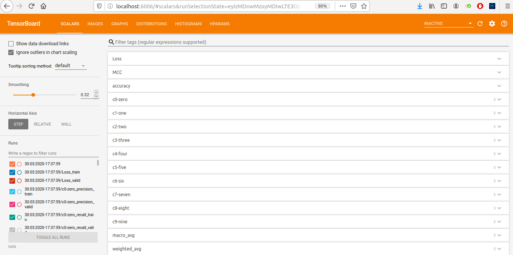

# Classification-Report

[](https://classification-report.readthedocs.io/en/latest/?badge=latest) [](https://github.com/aman5319/Classification-Report/blob/master/LICENSE.txt)

Classification Report is a high-level library built on top of Pytorch which utilizes Tensorboard and scikit-learn and can be used for any  classification problem. It tracks models Weight, Biases and Gradients  during training and generates a detailed evaluation report for the  model, all of this can be visualized on Tensorboard giving comphrensive  insights. It can also be used for HyperParameter tracking which then can be utilized to compare different experiments.




## Features

1. Model Weights, Biases and Gradients Tracking and plotting on histogram.
2. Visualizing the distribution of above described Model parameters.
3. Generating an interactive graph of the entire Model.
4. Graph of Precision, Recall and F1 Score for all the classes for each epoch.
5. Graph of Macro Avg and Weighted Avg of Precision, Recall and F1-score for each epoch.
6. Training and Validation Loss tracking for each epoch.
7. Accuracy and MCC metric tracking at each epoch.
8. Generating Confusion Matrix after certain number of epochs.
9. Bar Graph for False Positive and False Negative count for each class.
10. Scatter Plot for the predicited probabilities.
11. HyperParameter Tracking for comparing experiments.
### [For More Detail look in Features](https://classification-report.readthedocs.io/en/latest/detailed.html)


## [Installation](https://classification-report.readthedocs.io/en/latest/installation.html) 

```shell
pip install classification-report
```

## Demo
[Check the Demo](https://classification-report.readthedocs.io/en/latest/examples.html#demo)

## Usage
[Understand The Usage](https://classification-report.readthedocs.io/en/latest/examples.html)


## Say Thanks, By connecting me over Linkedin.

[](https://www.linkedin.com/in/aman5319/)