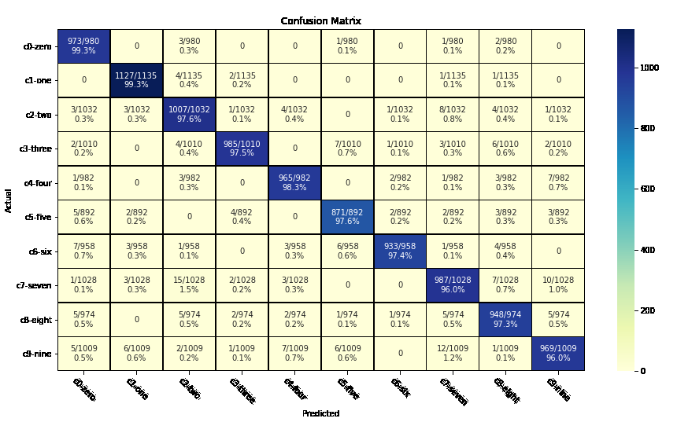

## Features

### 1.  Model Weights, Biases and Gradients Tracking and plotting on histogram.

### 2. Visualizing the distribution of above described Model parameters.

   

### 3. Generating an interactive graph of the entire Model

   

### 4. Graph of Precision, Recall and F1 Score for all the classes for each epoch.

### 5. Graph of Macro Avg and Weighted Avg of Precision, Recall and F1-score for each epoch.

   

### 6. Training and Validation Loss tracking for each epoch.

   

### 7. Accuracy and MCC metric tracking at each epoch.

### 8.  Generating Confusion Matrix after certain number of epochs.

### 9. Bar Graph for False Positive and False Negative count for each class.

### 10. Scatter Plot for the predicited probabilities.

### 11. Hyparameter Tracking for comparing experiments.

