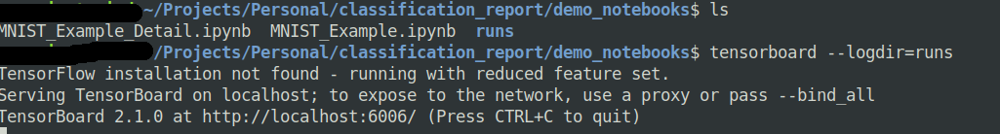

# Examples


## Creating Config

There are multiple scenarios where we need to create configuration like in context of deep learning 

 1. Model Config
 2. Training Config
 3. Inference Config

```python
>>> from classification_report import Config
>>> training_config = Config(lr=0.1, batch_size=32, device="GPU")
>>> model_config = Config(number_layers=3, num_head=32)
>>> model_config.number_layers
3
>>> training_config.lr
0.1
```

The benefit of using these config files are the  can be `saved as JSON file` and can be `loaded from a JSON file`

### Save Configuration

```python
>>> training_config.save_config_json("training_config.json")
Configuration Saved
```
### Load Configuration

```python
>>> training_config = Config.load_config_json("training_config.json") # Execute the saving code first.
>>> training_config.lr
```

### For other methods in Config check the API references.


## Creating HyperParameter

Since we can have many configs. It is necessary to combine all of them in place so that they can all be in one place and one can easily track all the `HyperParameter` to compare against multiple experiments.

`HyperParameter` class inherits from `Config` class so it supports all the method of `Config`.

```
>>> from classification_report import Config, HyperParameters
>>> model_config = Config(**{'hid_dim': 512,'n_layers': 8,'n_heads': 8,'pf_dim': 2048,'dropout': 0.1})
>>> training_config = Config(num_epochs=15, max_lr=0.09, batch_size=64)
>>> inference_config = Config(batch_size=16)
>>> hyper = HyperParameters(model_config = model_config, training_config=training_config,
infer_config=inference_config)
>>> hyper.model_config.hid_dim
512
>>> hyper.training_config.num_epochs
15
```

Similar to `Config` we can also save  and load this `HyperParameter` which is a collection of configs. 

while saving the `HyperParameter` it writes only in `one JSON` file.

```
>>> hyper.save_config_json("hyper.json")
Configuration Saved
>>> h = HyperParameters.load_config_json("hyper.json")
Saved Configuration Loaded
>>> h.training_config.num_epochs
15
```


## Creating Report

There are [demo_notebooks](https://github.com/aman5319/Classification-Report/tree/master/demo_notebooks) which can be executed to see the full potential of the this library.

[Simple MNIST with Simple Reporting Example](https://github.com/aman5319/Classification-Report/blob/master/demo_notebooks/MNIST_Example.ipynb)

[Simple MNIST with Detail Reporting Example](https://github.com/aman5319/Classification-Report/blob/master/demo_notebooks/MNIST_Example_Detail.ipynb)

This two notebook covers almost all the features of the library but to see details of it head over to [API References](https://classification-report.readthedocs.io/en/latest/autoapi/classification_report/report/index.html)


## Visualising Report

As the report is generated on the fly while the model is training. All the visualization can be seen using tensorboard.

Whenever this library is executed a `runs` folder is created  on the top-level and tensorboard uses that runs folder track.

This runs folder contains all the experiment and can be used to compare different experiments and can be shared among your teammates for studying.

The ideal way to visualize is to first execute the tensorboard from the same directory level from where all the notebooks are created.

```shell
tensorboard --logdir=runs
```




## Demo

### Goole Colab (Recommended)

​	Just open this notebook on colab and view the entire tensorboard visualization. - [Simple Mnist Simple Reporting Visualize on colab](https://github.com/aman5319/Classification-Report/blob/master/demo_notebooks/MNIST_Example_Visualize_in_Colab.ipynb)

### Manually Visualize a pre-existing experiment on your local.

   [Install the library](installation.md) After installing the library execute these commands.
```shell
git clone https://github.com/aman5319/Classification-Report # clone library 
cd Classification-Report/demo_notebook # change the directory
tensorboard --logdir=runs # execute tensorboard
```

