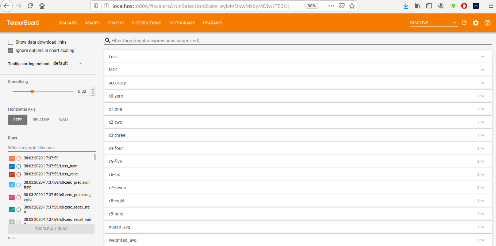

=================================================
Classification Reports Documentation
=================================================

Classification Report is a high-level library built on top of Pytorch which utilizes Tensorboard and scikit-learn and can be used for any classification problem. It tracks models Weight, Biases and Gradients during training and generates a detailed evaluation report for the model, all of this can be visualized on Tensorboard giving comphrensive insights. It can also be used for HyperParameter tracking which then can be utilized to compare different experiments.

Features
========
    1. Model Weights, Biases and Gradients Tracking and plotting on histogram.
    2. Visualizing the distribution of above described Model parameters.
    3. Generating an interactive graph of the entire Model.
    4. Graph of Precision, Recall and F1 Score for all the classes for each epoch.
    5. Graph of Macro Avg and Weighted Avg of Precision, Recall and F1-score for each epoch.
    6. Training and Validation Loss tracking for each epoch.
    7. Accuracy and MCC metric tracking at each epoch.
    8. Generating Confusion Matrix after certain number of epochs.
    9. Bar Graph for False Positive and False Negative count for each class.
    10. Scatter Plot for the predicited probabilities.
    11. Hyparameter Tracking for comparing experiments.

Detailed Features
=================

.. toctree::
   :caption: Detailed Features
   :hidden:
   
   detailed.md

:doc:`detailed` 
    Detailed description of the features with pictures of tensorbaord visualization.

.. toctree::
   :maxdepth: 2
   :caption: Quickstart
    
   installation.md
   examples.md

.. toctree::
   :maxdepth: 2
   :caption: Code Reference
   

Indices and tables
==================

* :ref:`search`
